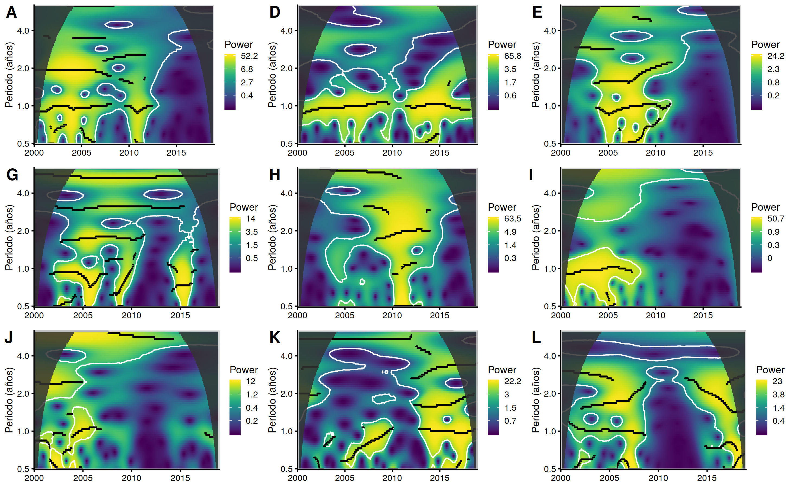

class: inverse, center, middle

```{r, include = FALSE}
options(htmltools.dir.version = FALSE, stringsAsFactors = FALSE)

# Librerias
library(ggplot2)
library(cowplot)
library(viridis)
library(dplyr)
library(sf)
library(knitr)

# Datos
#dep <- st_read("~/Datos/Shapes/Limites/departamento_geo.shp", quiet = TRUE)
#dis <- st_read("~/Datos/Shapes/Limites/DISTRITOS_v2.shp", quiet = TRUE)
#reg <- st_read("../Datos/Cluster/Regiones.shp", quiet = TRUE)

#reg.dis <- read.csv("../Datos/Cluster/Regiones_climaticas.csv")
#reg.tab <- read.csv("../Datos/Cluster/Regiones_resumen.csv")

# Graficos
#load("../../Graficos/4-Graficos_paper.Rdata")
load("../../Graficos/3.1-Dat_graph.RData")
load("../../Graficos/3.2-Dat_graph.Rdata")

tab <- read.csv("../../Datos/Cluster/Regiones_resumen.csv") %>%
	rename(
		`T` = Temperatura_med,
		`T sd` = Temperatura_sd,
		`Pp` = Precipitacion_med,
		`Pp sd` = Precipitacion_sd)
tab[, -1] <- round(tab[, -1])
```

# Objetivos

---

## General

- Evaluar la relación entre el comportamiento de la malaria y la variabilidad climática en el Perú para el periodo 2000 - 2014

## Específicos

- Generar regiones climáticas a nivel de distritos basados en el comportamiento promedio anul de la precipitación y la temperatura media.

- Analizar el comportamiento temporal de la malaria en las regiones climáticas.

- Analizar la coherencia y desfase entre la malaria y la precipitación, temperatura máxima y temperatura mínima en las regiones clmiáticas.

---

class: inverse, center, middle

# Metodología

---

.pull-left[
## Área y periodo de estudio

- Información temporal desde el año 2000 hasta el 2018.

- Distritos con una altitud media menor o igual a 1500 m.s.n.m. y que se encuentren en la vertiente del Pacífico.
]

.pull-right[
## Datos

- Casos semanales de malaria *P. falciparum* y *P. vivax* (CDC - Perú).

- Precipitación cada 3 horas, 0.25° x 0.25° (TRMM - 3B42).

- Temperatura a 2 metros cada 3 horas, 0.25° x 0.25° (GLDAS 2.1).

- Población anual (INEI).

- Límites políticos (INEI). 

- Altitud (GEBCO 2019).
]

---

## Procedimiento


---

class: inverse, center, middle

# Resultados y discusiones

---

## Distribución de casos de malaria

.pull-left[
```{r mapa-malaria, echo = FALSE}
print(mal.gra.viv)
```
]

.pull-right[
- La mayoría de casos concentrados en selva baja.

- Zona aledaña al río Amazonas con menor cantidad de casos,

- Alta tasa de incidencia en dos distritos de Madre de Dios.
]

---

## Regionalización climática

.pull-left[
```{r mapa-reg, echo = FALSE}
print(mp.grup)
```
]

.pull-right[
```{r tabla, echo = FALSE}
#knitr::kable(tab)
print(tab)
```
]

---

## Comportamiento temporal de la malaria



---

## Relación con el clima


---

class: inverse, center, middle

# Conclusiones

---

- La regionalización climática ayuda a generalizar el análisis temporal que se puede realizar a la malaria ya que la distribución espacial de los casos guarda una relación regiones, al menos visualmente. Sin embargo, existen comportamientos espaciales específicos que las regiones no son capaces de representar.

- La malaria se caracteríza por tener un comportamiento anual predominante, aunque parte del comportamiento se pierde en el 2010 que puede estar asociado a una sequía. Es posible encontrar otros patrones, como los bienales y cuatrienales.

- Existe una relación entre el comportamiento temporal de la malaria y la variabilidad climática a una escala anual, aunque nuevamente mermada en el 2010. En aquellas regiones climáticas más extensas es donde no se encuentra una fuerte coherencia, que puede deberse a la alta variabilidad interanual.

---

class: inverse, center, middle

# Preguntas sin responder

---

- Existen nuevas fuentes de información climática (GPM y ERA 5) que, en teoría, tienen una mejor performance que la data utilizada en este estudio. ¿Los resultados serán los mismos con estas nuevas fuentes?

- Temperatura y precipitación no son las únicas variables climáticas relacionadas a la malaria. ¿Se podrá complementar la explicación del comportamiento de la malaria con más variables climáticas?

- En el estudio se concluye que parte del comportamiento temporal de la malaria responde al clima, pero ¿será posible que el clima solo funcione como un gatillador?