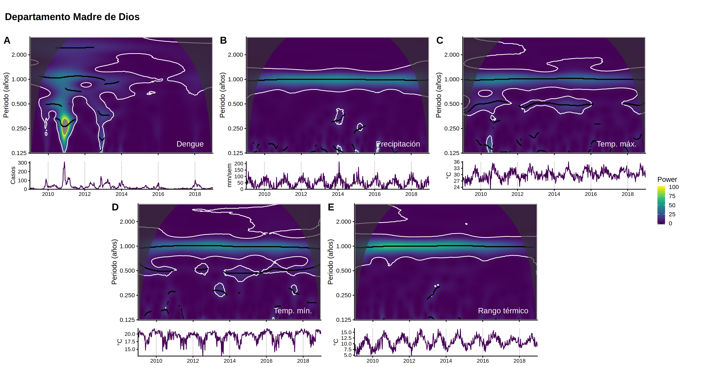
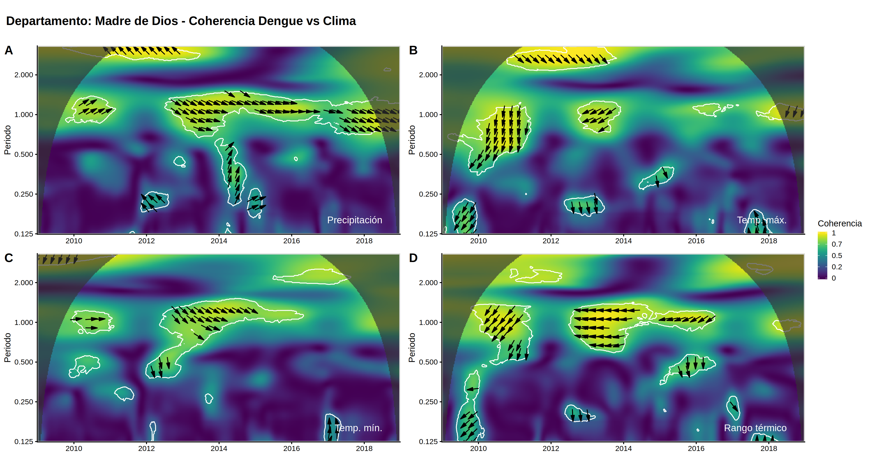
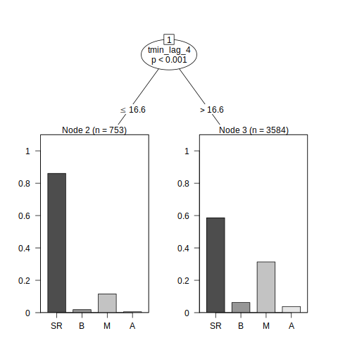
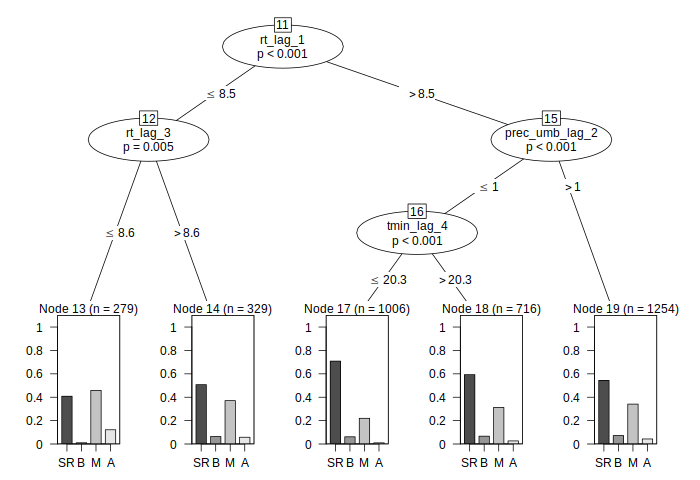

El contenido del siguiente reporte es el siguiente:

- Determinación del comportamiento temporal de los casos de dengue y variables climáticas utilizando *Wavelet Power Spectrum*.
- Determinación de la coherencia entre los casos de dengue y las variables climáticas utilizando *Wavelet Coherence*.
- Agrupación de los casos de dengue basado en el comportamiento del clima ocurrido entre 1 y 4 semanas antes con *Árboles de inferencia condicional*.

## Comportamiento temporal

En el caso del dengue, se tiene un comportamiento anual signficativo en todo el periodo 2009 - 2018. Este comportamiento es más intenso entre los años 2009 y 2014, que corresponde con una gran cantidad de casos. En este mismo periodo se presentan comporamientos a otras escalas temporales de mayor frecuencia, como el de medio año (periodo igual a 0.5) o un cuarto de año (periodo igual a 0.25). 

En el caso de las variables climáticas, se presenta un fuerte comportamiento anual como es de esperarse. 

## Coherencia temporal

Cuando se hace el cruce de los casos de dengue con las 4 variables climáticas utilizando *Wavelet Coherence*, se puede observar que existe una coherencia significativa con la precipitación a partir del 2012 y que un aumento de la lluvia  suele adelantarse entre 2 a 4 semanas a un aumento en los casos de dengue (flechas apuntando hacia abajo a la derecha). Una coherencia similar se encuentra con la temperatura mínima, pero esta solo se da hasta el 2017. 

En el caso del rango térmico (diferencia entre temperatura máxima y mínima) se tiene una coherencia también entre el 2012 y 2017, pero esta se encuentra en antifase (flechas apuntando a la izquierda), lo que quiere decir que un pico en casos de dengue se da al unísono con un bajo rango térmico.

En el caso de la temperatura máxima existe coherencia entre 2010 - 2011, donde una disminución de esta variable precede a un pico de casos de dengue 3 meses después (flecha apuntando hacia abajo); y 2012 - 2013, donde el desfase se reduce a un mes y medio (flechas apuntando hacia abajo a la izquierda).

## Agrupación por clima 

### Descripción de variables

Las variables utilizadas en esta sección tienen la siguiente estructura:

`[variable]_lag_[#]`

Donde `[variable]` pueden ser:

- `tmin`: Temperatura mínima promedio.
- `tmax`: Temperatura máxima promedio.
- `rt`: Rango térmico promedio.
- `prec`: Preciptación promedio diaria en una semana (mm/día).
- `prec_umb`: Cantidad de días en una semana con lluvia mayor a 10 mm/día.

Y `[#]` hace referencia a la cantidad de semanas de desfase respecto a los casos de dengue.

Por ejemplo, la variable `tmax_lag_2` hace referencia al promedio de la temperatura máxima con dos semanas de anticipación.

En el caso de la variable de respuesta, se categorizan los casos de dengue según su tasa de incidencia en diez mil personas (TI), siendo las categorías:

- `SR`: Sin riesgo (TI = 0)
- `B`: Bajo riesgo (TI > 0 y TI <= 1)
- `M`: Medio riesgo (TI > 1 y TI <= 10)
- `B`: Alto riesgo (TI > 10)

### Análisis

Cuando se agrupa la tasa de incidencia de dengue por distrito según las variables climáticas considerando de 1 a 4 semanas de desfase, es la temperatura mínima de 4 semanas atrás la de mayor influencia. Cuando esta temperatura es menor a 16.6°C, es más probable que un distrito no presente casos de dengue 4 semanas despues.

Analizando esta situación a más detalle (temperatura mínima de hace 4 semanas menor a 16.6°C), se observa que si la temperaturá máxima de una semana atrás es baja (menor a 26.7°C) y también lo es 3 y 4 semanas atrás (menor a 27.8°C), no existe situación en la que se presenten casos de dengue. Por otro lado, si la temperatura máxima una semana antes es alta (mayor a 26.7°C) y la precipitación promedio diaria de hace dos semanas fue alta (mayor a 15 mm/día), existe una probabilidad del 60% de tener una situación de riesgo medio.

En la situación contraria (temperatura mínima de 4 semanas atrás mayor a 16.6°C), si el rango térmico de hace 1 y 3 semanas atrás fue bajo (menor a 8.5°C), existe cerca del 45% de probabilidad de tener un riesgo medio y un 15% de un riesgo alto. En el resto de los escenarios aumenta la probabilidad una situación sin riesgo.

## Conclusión

Los casos de dengue en Madre de Dios presentan un comportamiento anual predominante cuyos picos se encuentran asociados a un aumento en la precipitación y temperatura mínima con 2 a 4 semanas de anticipación.

Basado en la agrupación de la tasa de incidencia de dengue por distritos, las condiciones de temperatura máxima y mínima en una semana determinan si se presentarán casos de dengue 4 semanas después. Es posible encontrar un aumento de casos bajo condiciones de altas temperaturas con altas precipitaciones, o alta temperatura mínima con un bajo rango térmico.