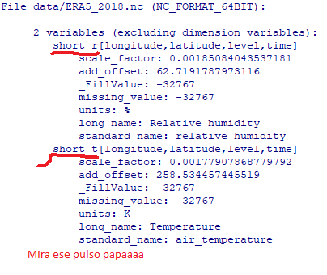
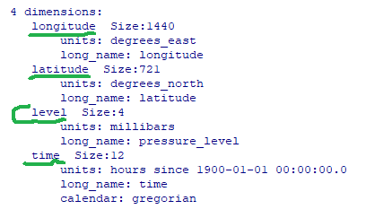

[//]: <> (2)

```{r setup, include = FALSE}
options(htmltools.dir.version = FALSE)
library(dplyr)
library(raster)
library(ncdf4)
library(rNOMADS)
library(rgdal)
library(sf)
library(maps)
```

# Índice

### Veremos los archivos más comunes en meteorología.

--

- Información tipo vectorial *(shapefiles)*.

--

- Información tipo raster *(tiff)*.

--

- Información grillada *(netCDF - grib)*.

---

layout: true

## Información vectorial

---
[//]: <> (3)

class: inverse, center, middle

### *shapefiles*

---
[//]: <> (4)

Dentro de R existen dos formas para trabajar estos datos

- `library(rgdal)`

- `library(sf)`

--

A pesar de que `rgdal` es más sencillo, [`sf`](https://r-spatial.github.io/sf/articles/) es más moderno, más eficiente y puede interactuar con `dplyr`

---
[//]: <> (5)

Probemos leyendo los departamentos de Perú.

```{r, eval = TRUE}
dep = st_read("data/shapes/Limite_departamental/BAS_LIM_DEPARTAMENTO.shp", stringsAsFactors = F)
```

---
[//]: <> (6)

...y que contiene?

```{r, eval = FALSE}
head(dep)
```

--

```{r, echo = FALSE, out.width = "100%"}
knitr::include_graphics("https://r-spatial.github.io/sf/articles/sf_xfig.png")
```

.tiny[ok, no sale eso pero es un ejemplo nomás]

---
[//]: <> (7)

"...ok, todo muy bonito y xvr, pero no se supone que debería en un *mapa* porque... es un .bold[*mapa*]"

```{r, echo = F, out.width = "15%"}
knitr::include_graphics("https://i.kym-cdn.com/photos/images/original/000/787/356/d6f.jpg")
```

--

```{r, eval = T, out.width = "30%"}
plot(dep)
```

.tiny[ahí ta pe...]

---
[//]: <> (8)

"...ya, pero yo quiero el mapita nomas, osea el contor, *manyas*?"

.center[
```{r, echo = F, out.width = "10%"}
knitr::include_graphics("http://www.memes.at/faces/rage_eyes.jpg")
```
]

--

```{r, eval = T, out.width = "35%"}
plot(dep$geometry, axes = T)
```

.tiny[...contento?]

---
[//]: <> (9)

"oeoeoeoeoe pero que cha son esas coordenadas?"

--

Bueno, el shape de los departamentos está en coordenadas *UTM*. Llevémoslo a algo más familiar, como las coordenadas *longitud/latitud*.

```{r, eval = T, out.width = "45%"}
dep = st_transform(dep, 4326)
plot(dep$geometry, axes = T)
```

---
[//]: <> (10)

"...ya ya, pero ta monce esa gráfica. ¿No se puede hacer más xvr como para meterlo a mi informe y decir que si hice algo?"

--

Claro ps chuleta. Aquí un ejemplo con la columna `HECTARES`.

```{r, eval = T, out.width = "45%"}
plot(dep["HECTARES"], axes = T, graticule = T, key.pos = 4)
```

---
[//]: <> (11)

"...ahí si se ve bonis .tiny[*mmmfff*]. Ahora quiero que solo se vea Lima pero de color botella Pilsen."

--

```{r, eval = T, out.width = "45%"}
plot(st_geometry(dep), axes = T, graticule = T)
plot(dep[15, "NOMBDEP"], add = T, col = "darkgreen")
```

.tiny[Habla, unas chelas?]

---
[//]: <> (12)

También podemos hacer selecciones con `dplyr::filter` como si el shape fuera una tabla o `data.frame`

--

```{r, eval = T, out.width = "50%"}
chela = dplyr::filter(dep, COUNT > 100)
chela = dplyr::select(chela, HECTARES)
plot(st_geometry(dep), axes = T, graticule = T)
plot(chela, add = T)
```

---
[//]: <> (13)

Por último exportemos nuestro shape con coordenadas *longitud/latitud*.

```{r, eval = FALSE}
st_write(dep, "data/shapes/departamentos_geo.shp")
```

---
[//]: <> (14)

layout: false
class: inverse, center, middle

### Ejercicio 1

Se dice que en Huancayo se toma más chela que agua. Entonces, ubiquen aquellos departamentos que sean más pequeños que el departamento donde se encuentra Huancayo. Los departamentos seleccionados deberán estar coloreados según su tamaño, el resto de departamentos deberán estar en blanco y deben mostrar también las líneas de latitud y longitud.

---

layout: true

## Información tipo raster

---
[//]: <> (15)

class: inverse, center, middle

Jugaremos con imágenes satelitales.

---
[//]: <> (16)

Usualmente las imágenes satelitales (y algunos otros productos) son distribuídos en un formato llamado Tiff o GeoTiff.

Los paquetes que se suele usar es

- `library(raster)`

que puede ser complementado con otros paquetes como

- `library(rasterVis)`

- `library(rgdal)`

- `library(gdalUtils)`

---
[//]: <> (17)

Probemos abriendo una imagen satelital de Perú.

```{r, eval = TRUE, out.width = "100%"}
library(raster)
rtr = raster("data/PE_OR_ABI-L2-CMIPF-M3C13_G16_s20180102000410.tiff")
print(rtr)
```

---
[//]: <> (18)

Lo que tenemos es un RasterLayer (pueden chequearlo con `class(rtr)`). 

RasterLayer es un tipo de estructura, por lo que podemos ver su contenido con `str()`.

--

Prueben...

```{r, eval = FALSE}
str(rtr)
```

--


---
[//]: <> (19)

Se que había muchas chucherías ahí pero no se preocupen, muchos de esos datos se le conoce como atributos. Un RasterLayer es en esencia una matriz con información adicional.

--

Mejor veámoslo en una gráfica!

```{r, eval = T, out.width = "50%"}
plot(rtr, axes = T)
```

---
[//]: <> (20)

"...y podemo juntarlo con el shape que cargamos antes?"

--

.center[
```{r, echo = FALSE, out.width = "40%"}
knitr::include_graphics("https://pbs.twimg.com/media/D0H3oCzXgAAZdXR.jpg")
```
]

---
[//]: <> (21)

```{r, eval = T, out.width = "60%"}
dep = st_read("data/shapes/departamentos_geo.shp", quiet = T)
plot(rtr, axes = T, col = heat.colors(64))
plot(dep$geometry, add = T)
```

---
[//]: <> (22)

Hagamos un pequeño recorte sobre Junin y cambiemos un poco los valores.

```{r, eval = F}
dep = st_read("data/shapes/departamentos_geo.shp", quiet = T)
rtr2 = crop(rtr, extent(-77, -73, -13.5, -10)) 
rtr2 = (rtr2 - mean(rtr2)) / sd(rtr2) #<<
plot(rtr2, axes = T, col = heat.colors(64))
plot(dep$geometry, add = T)
```

--

.small[uhhh... error?]


---
[//]: <> (23)

Para aplicar funciones a la matriz, es necesario indicar que vamos a trabajar con la matriz, no con el RasterLayer.

```{r, eval = T, out.width = "45%"}
dep = st_read("data/shapes/departamentos_geo.shp", quiet = T)
rtr2 = crop(rtr, extent(-77, -73, -13.5, -10)) 
rtr2 = (rtr2 - mean(rtr2[])) / sd(rtr2[]) #<<
plot(rtr2, axes = T)
plot(dep$geometry, add = T)
```

---
[//]: <> (24)

class: middle

Y bueno, se pueden hacer muchas más cosas, pero para una introducción es más que suficiente. Las imágenes raster son fáciles de manejar.

---
[//]: <> (25)

layout: false
class: inverse, center, middle

### Ejercicio 2

Bueno bueno, de seguro se están preguntando *¿qué cha es esa imagen que acabamos de usar?*. Resulta que es una imagen de la temperatura en el tope de la nubes para zona del Perú del satelite GOES 16. Pero esa escala de valores era cualquier cosa menos temperatura ¿cierto? Bueno su chamba será arreglar la imagen satelital.

Para arreglar la imagen, primero es necesario multiplicarlo por 0.0614533 y luego sumarle 89.62, con eso obtendremos los valores en Kelvin. 

Ahora, transformen la imagen a temperatura y muestren el resultado sobre Ayacucho.

.

.footnotesize[Nota: Los meteorólogos usamos la temperatura de brillo de las nubes como un indicador de la presencia de lluvias. Más frío, más probable que esté lloviendo.]

---

layout: true

## Información grillada.

---
[//]: <> (26)

Veremos dos tipos de información grillada.

- Archivos netCDF.

- Archivos grib (1 y 2).

Empecemos por el archivo netCDF

---
[//]: <> (27)

Primero, leamos el archivo ERA5_2018.nc y vemos lo que tiene

```{r, eval = TRUE}
library(ncdf4)
era = nc_open("data/ERA5_2018.nc")
print(era)
```

---
[//]: <> (28)

Ok ok, que no cunda el panico! Es mucha información, pero es importante prestarle atención ya que en ella encontraremos el nombre de las dimensiones y las variables. Resulta que los archivos netCDF tiene oooooootro tipo de estructura.

.pull-left[

]

.pull-right[

]

---
[//]: <> (29)

Probemos leyendo todo lo que tiene el archivo. Es información mensual del 2018 de temperatura y humedad relativa para 4 niveles de la atmósfera.

```{r, eval = TRUE}
era = nc_open("data/ERA5_2018.nc")
temp = ncvar_get(era, "t")
hr = ncvar_get(era, "r")
lon = ncvar_get(era, "longitude")
lat = ncvar_get(era, "latitude") 
lev = ncvar_get(era, "level") 
time = ncvar_get(era, "time") 
```

--

¿Cuál es su estructura?

Prueben con `str()` y `dim()`

---
[//]: <> (30)

Recortemos la data para Perú, el procedimiento no es tan directo como el que hizo con el raster (hay que hacerlo a la antigua). También seleccionaremos solo el nivel de 1000 hPa y el segundo mes.

```{r, eval = TRUE}
lon = lon - 360 #<<
setlon = lon >= -84 & lon <= -66
setlat = lat >= -20 & lat <= 2
setlev = lev == 1000
settim = 2
lon = lon[setlon]
lat = lat[setlat]
temp = temp[setlon, setlat, setlev, settim] - 273.15
```

--

Ahora, hay un pequeño detalle con la latitud, ¿pueden darse cuenta de cuál es?

---
[//]: <> (31)

Antes de graficar, necesitamos invertir las latitudes.

.bold[Siempre fíjense de eso!]

```{r, eval = TRUE}
lat = lat[length(lat):1]
temp = temp[ ,length(lat):1]
```

```{r, eval = T, out.width = "40%"}
image(x = lon, y = lat, z = temp)
```

---
[//]: <> (32)

"...como que la gráfica esta medio moncefú ¿no?"

Probemos con `library(fields)` aer si nos da una mejor opción.

```{r, eval = T, out.width = "50%"}
fields::image.plot(x = lon, y = lat, z = temp)
```

---
[//]: <> (33)

"...si, ta mejor. Se le puede poner los departamentos como hicimos con el raster"

Todo es posible! .tiny[menos que apruebes tus finales :v]

--

```{r, eval = T, out.width = "40%"}
dep = sf::st_read("data/shapes/departamentos_geo.shp", quiet = T)
fields::image.plot(x = lon, y = lat, z = temp)
plot(dep$geometry, add = T)
```

---
[//]: <> (34)

"...no me gusta que esté así cuadriculado. ¿No hay otra forma de graficarlo?"

Bueno, si y no. Existe el comando `filled.contour()`, pero cuando lo intentamos juntar con el mapa del departamento, cosas raras salen.

--

```{r, eval = T, out.width = "40%"}
filled.contour(x = lon, y = lat, z = temp)
plot(dep$geometry, add = T)
```

---
[//]: <> (35)

"...y ahora? :'("

--

Felizmente, dentro del script `Meteorite.r` existen funciones que permiten hacer este procedimiento.

```{r, eval = T, out.width = "40%"}
source("data/Meteorite.r")
dep = sf::st_read("data/shapes/departamentos_geo.shp", quiet = T)
filled.contour.plot(x = lon, y = lat, z = temp)
plot(dep$geometry, add = T)
```

---
[//]: <> (36)

El script `Meteorite.r` tiene muchas más funciones para trabajar información grillada, pero las utilizaremos más a fondo la próxima clase. Por hoy, solo tenemos que familiarizarnos con los datos.

.center[

]

---
[//]: <> (37)

layout: false
class: inverse, center, middle

###Ejercicio 3

Bueno ahora juguemos con la data de humedad relativa. Primero ubíquense sobre Lima. Ahora comparen la humedad relativa a 1000 hPa (superficie)  y a 500 hPa (niveles medios) para un mes de verano y otro de invierno. ¿Que diferencias encuentran?

Junten todo el procedimiento en un script.

---

layout: true

## Información grillada

---
[//]: <> (38)

Ahora veremos los archivos grib con `library(rNOMADS)`... masomenos...

--

Aun con el paquete `rNOMADS`, R no es capaz de leer información grib. Es necesario instalar otro programita antes, pero no veremos eso ahora.

Lo que si nos permite `rNOMADS` es conectarnos al servidor de la NOAA para leer y descargar datos de pronósticos!

---
[//]: <> (39)

.bolder[¡Tengan cuidado!]

Todo lo que haremos a continuación requiere conexión a internet. Ya que estamos familiarizados con la información grillada, correré un poco.

Pueden seguir los ejemplos si desean, pero la idea es que lo repliquen en sus casas con una conexión estable... 
--
a menos que sean pitucos y quieren gastar sus datos. 

tiny.[compartan pe :'v]

---
[//]: <> (40)

Accederemos a pronósticos de 0.5 grados de resolución espacial.

```{r, eval = T}
library(rNOMADS)

# Obteniendo modelo
urls.out = GetDODSDates(abbrev = "gfs_0p50")
model.url = tail(urls.out$url, 1)

# Obteniendo la corrida más reciente
model.runs = GetDODSModelRuns(model.url)
model.run = tail(model.runs$model.run, 1)

# Veamos temperatura para las siguientes 6 horas y 1000 hPa
variable = "tmpprs"
time = c(2,2)
lev = c(1,1) # 1000 hPa

# Seleccionando coordenadas
lon.dom <- seq(0, 360, by = 0.5)
lat.dom <- seq(-90, 90, by = 0.5)
lon <- which((lon.dom >= 360 - 84) & (lon.dom <= 360 - 66)) - 1
lat <- which((lat.dom <= 2) & (lat.dom >= -20)) - 1
```

---
[//]: <> (41)

```{r, eval = T}
# Leyendo datos
data = DODSGrab(model.url, model.run, variable, time, c(min(lon), max(lon)), c(min(lat), max(lat)), lev = lev)

# Convirtiendolo en grilla
grilla = ModelGrid(data, c(0.5, 0.5))

# Chequeando el resultaddo
str(grilla)
```

---
[//]: <> (42)

Ahora vamos a graficar el resultado

```{r, eval = T, out.width = "40%"}
source("data/Meteorite.r")
dep = sf::st_read("data/shapes/departamentos_geo.shp", quiet = T)
filled.contour.plot(x = grilla$x - 360, y = grilla$y, z = grilla$z[1,1,,])
plot(dep$geometry, add = T, border = "grey20")
contour(x = grilla$x - 360, y = grilla$y, z = grilla$z[1,1,,], add = T)
```

---
[//]: <> (43)

layout: false
class: inverse, center, middle

# Ejercicio pa' la casa

Bueno, para ver si lo último quedó claro deberán hacer un script que lea la data de pronósticos de la NOAA y muestre la precipitación acumulada de las próximas 12 horas para la selva del Perú.

.small[Consejo: La información de precipitación no tiene nievels de presión, por lo que la variable `lev` no la van a utilizar]
 
---

class: inverse, center, middle

# Gracias por aguantarme!

Si tienen dudas pueden escribirme a: dante.tcg@gmail.com

Las clases pueden encontrarlas en

<https://danteca.github.io/>

Chau!

