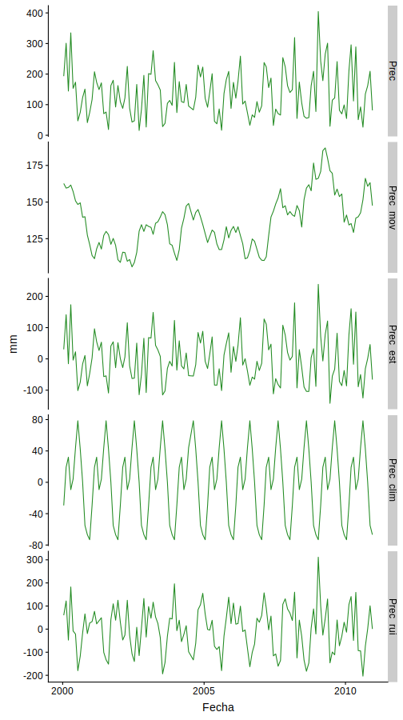

[//]: <> (2)

```{r setup, include = FALSE}
options(htmltools.dir.version = FALSE, stringsAsFactors = FALSE)
library(cowplot)
library(dplyr)
library(reshape2)


medmov = function(x, n){

	res = rep(NA, length(x))
	
	for( i in (n+1):(length(x)-n) ){
	
		res[i] = mean( x[(i-n):(i+n)] )
	
	}
	
	return(res)

}

nino = read.table("data/nina34.data.txt", header = F, na.string = "-99.99")
colnames(nino) = c(
	"Anio", "M01", "M02", "M03", "M04", "M05", "M06", 
	"M07"	, "M08", "M09", "M10", "M11", "M12")
nino = nino %>%
	melt(
		id.vars = "Anio",
		variable.name = "Mes",
		value.name = "TSM"
	) %>%
	arrange(Anio, Mes) %>%
	mutate(
		Mes = as.integer(substr(Mes, 2, 3)),
		TSM = medmov(TSM, 1)
	) %>%
	filter(Anio %in% 1950:2018)

# Calculo del climatología
nino_clim = nino %>%
	filter(Anio %in% 1981:2010) %>%
	group_by(Mes) %>%
	summarize(Clim = mean(TSM, na.rm = T))
	
# Calculo de anomalía
nyear = max(nino$Anio) - min(nino$Anio) + 1
nino = nino %>%
	mutate(
		Fecha = as.Date(paste(Anio, Mes, 15, sep = "-"), format = "%Y-%m-%d"),
		Clim = rep(nino_clim$Clim, times = nyear), 
		Anom = TSM - Clim
	) %>%
	filter(Anio %in% 1981:2010)

```

# Recapitulando

La clase pasada vimos una introducción a lo que era series de tiempo:

 - Características generales

 - Descomposición de series de tiempo
 
Para que los conceptos de hace dos semanas no se les esfume, los vamos a volver a utilizar hoy.

---
[//]: <> (3)

# Clase de hoy

Los temas del día de hoy son también sencillos, pero lo vamos a subir un poco el level metiendole algo de estadística.

 - Autocorrelaciones.
 
 - Análisis de puntos de corte (o también puntos de inflexión, *breakpoints* o *changepoints*).
 
 - Introducción a Fourier.

---
[//]: <> (4)

## Recordar es volver a vivir...

.pull-left[

]

.pull-right[
Descomposición de series de tiempo, específicamente la tendencia.

Retirar la estacionalidad también es una buena idea.
]

---
[//]: <> (5)

### Regresión lineal

Es el proceso de tomar una linea y ajustarla a los puntos que se tengan. El proceso suele ir acompañado con el cálculo del coeficiente de Pearson $R$.

```{r, echo = F, warning = F, fig.height = 5}
reg = lm(Anom ~ as.integer(Fecha), data = nino)
ggplot(nino, aes(Fecha, Anom)) +
	geom_line(colour = "brown") +
	geom_smooth(method = lm)
```

---
[//]: <> (6)

¿Recuerdan que son los residuos? 
--
Es el resultado de la comparación entre el modelo y la data observada, en otras palabras...

$$Residuo = Observado - Modelado$$

--

```{r, echo = F, warning = F}
inte = reg$coefficients[1]
pend = reg$coefficients[2]

nino = mutate(nino, 
	Regresion = inte - pend*as.integer(Fecha),
	Residuo = Anom - Regresion)

ggplot(nino, aes(x = Fecha)) +
	geom_linerange(aes(ymin = Regresion, ymax = Anom), colour = "grey80") +
	geom_line(aes(y = Regresion), colour = "black") +
	geom_point(aes(y = Anom), colour = "brown") 
```

---
[//]: <> (7)

class: inverse, bottom, right
background-image: url("img/forest.jpg")
background-size: cover

# Autocorrelaciones

Ya estamos *ready*

---
[//]: <> (8)

### ¿Qué michi es la autocorrelación?

--

El nombre lo dice todo...

En esencia es la correlación que una variable tiene consigo mismo, .bold[peeero] con un pequeño detalle.

--

A la correlación se le aplica un *desfase* (llamados *lags*). Eso quiere decir que correlación toda la data con la misma data pero desfasado un día, luego dos, luego tres y así sucesivamente.

```{r, echo = F}
tab = data.frame(
	"t" = paste0("a",1:5), 
	"t+1" = paste0("a",2:6), 
	"t+2" = paste0("a",3:7),
	"t+3" = paste0("a",4:8),
	"t+4" = paste0("a",5:9),
	"t+5" = paste0("a",6:10))
knitr::kable(tab, format = "html")
```

---
[//]: <> (9)

Si tuvieramos que calcular hasta la autocorrelación de 20mo orden, tendríamos esta secuencia lógica.

```
tsm = 100 trimestres de TSM

for( del 1 al 20 ){

	autocorr orden i = correlacion entre (
	
		tsm[del 1 al 100 menos i] y 
		tsm[del 1+i al 100]
		
	)
	
}
```

---
[//]: <> (10)

Si graficamos los valores de autocorrelación de la anomalía de temperatura superficial entre 1980 y 2010, tendremos la siguiente gráfica

```{r, echo = F, warning = F}
auto = numeric(20)
n = nrow(nino)
for(i in 1:20){
	auto[i] = cor(nino$Anom[1:(n-i)], nino$Anom[(1+i):n])
}
auto_tab = data.frame(Desfase = 1:20, Autocorrelacion = auto)
ggplot(auto_tab, aes(x = Desfase)) +
	geom_linerange(aes(ymin = 0, ymax = Autocorrelacion), col = "dodgerblue") +
	geom_point(aes(y = Autocorrelacion), col = "brown") +
	geom_hline(yintercept = 0)
```

---
[//]: <> (11)

### Autocorrelación parcial


--

En lugar de correlacionar la data con la data desfasada, lo que vamos a correlacionar son los residuos que salen de cada correlacion con la data desfasada, luego se calculan nuevos resiudos y se vuelve a correlacionar pero con el siguiente desfase, y así sucesivamente.

---
[//]: <> (12)

La secuencia lógica sería

```
tsm = 100 trimestres de TSM
residuos = tsm

for( del 1 al 10 ){

	autocorr orden i = correlacion entre (
	
		residuos y
		tsm[del 1+i al 100]
		
	)
	
	pendiente = pendiente de la regresion
	intercepto = intercepto de la regresion
	
	estimado = intercepto + pendiente*tsm[del 1+i al 100]
	residuos = residuos - estimado
	
}
```

---
[//]: <> (13)

Gráficamente tenemos

```{r, echo = F, warning = F}
resi = nino$Anom
for(i in 1:20){
	auto[i] = cor(resi[1:(n-i)],nino$Anom[(1+i):n])
	mode = lm(resi[1:(n-i)] ~ nino$Anom[(1+i):n])
	inte = mode$coefficients[1]
	pend = mode$coefficients[2]
	simu = inte + pend*nino$Anom[(1+i):n]
	resi = resi[1:(n-i)] - simu
}
auto_tab$Parcial = auto
ggplot(auto_tab, aes(x = Desfase)) +
	geom_linerange(aes(ymin = 0, ymax = Parcial), col = "dodgerblue") +
	geom_point(aes(y = Parcial), col = "brown") +
	geom_hline(yintercept = 0)
```

---
[//]: <> (14)

[](https://www.youtube.com/watch?v=ZjaBn93YPWo)

---
[//]: <> (15)

class: inverse, bottom, center
background-image: url("img/lines.jpg")
background-size: cover

# *Breakpoints*

Si les pareció yuca el anterior...

les tengo malas noticias...

---
[//]: <> (16)

## Ahora si, *changepoints*

En pocas palabras, es el nombre que se le da al instante en el tiempo en donde cambian algunas características estadísticas de la serie (1).

```{r, echo = F, fig.height = 5}
x1 = rnorm(100, 75, 2)
x2 = rnorm(150, 110, 4)
dat = data.frame(Segundos = 1:250, Ran = c(x1,x2))

ggplot(dat, aes(Segundos, Ran)) +
	geom_line(colour = "dodgerblue") +
	labs(title = "Ritmo cardiaco cuando te encuentras con\ntu EX que aun no superas")
```

.bottom[.tiny[(1) Killick, R. & Eckley, I. 2014. changepoint: An R Package for Changepoint Analysis]]

---
[//]: <> (17)

Pero un momentito, la media no es la única característica estadística que pude generar un punto de quiebre ¿cierto?

--

```{r, eval = T, echo = F}
x1 = rnorm(100, 75, 2)
x2 = rnorm(150, 75, 8)
dat = data.frame(Segundos = 1:250, Ran = c(x1,x2))

ggplot(dat, aes(Segundos, Ran)) +
	geom_line(colour = "brown") +
	labs(title = "Arritmia de un alumno que al enterarse que necesita\nun 21 para aprobar la trika")
```

---
[//]: <> (18)

Existen muchas metodologías para detectar los *changepoints*, cada uno con sus puntos a favor y en contra, por lo que es difícil decir que existe una metodología mejor que otra.

--

.pull-left[
.small[Mencionados en (2)]

- .small[.blue[Standard normal homogeneity test (SNH)]]
- .small[Nonparametric SNH test]
- .small[Two-phase regression of Wang]
- .small[TPR of Lund and Reeves]
- .small[Una fumada del autor]
- .small[Method of Vincent]
- .small[Akaike's information criteria]
- .small[Sawa's Bayes criteria]
]

--

.pull-right[
.small[Mencionados en (1)]

- .small[Binary segmentation]
- .small[Segment neighborhoods]
- .small[Pruned exact linear time]
]

.bottom[
.tiny[(1) Killick, R. & Eckley, I. 2014. changepoint: An R Package for Changepoint Analysis]

.tiny[(2) Reeves, J. *et al*. 2007. A Review and Comparison of Changepoint Detection Technique for Climate Data]
]

---
[//]: <> (18)

### Standard normal homogeneity test (SNH) (2)

En esencia, lo que hace es partir la serie de tiempo en un punto $c$ y analizar si la media de las dos series son iguales ( $H_0$ ) o diferentes ( $H_A$ ).

--

$$T_{max}=\max_{1\le c\lt n}|T_c|$$

$$T_c={\overline{Y_1}-\overline{Y_2}\over s_p\sqrt{c^{-1}+(n-c)^{-1}}}$$

$$s_p=\left[\frac{(c-1)s_1^2+(n-c-1)s_2^2}{n-2}\right]^{1/2}$$

.bottom[
.tiny[(2) Reeves, J. *et al*. 2007. A Review and Comparison of Changepoint Detection Technique for Climate Data]
]

---
[//]: <> (19)

### No tan rápido!

Como vieron, esto se basa en una prueba estadística (por las hipótesis), y como toda prueba estadística esta sujeta a algunos supuestos

- La serie de datos $Y_t$ debe ser *idendependiente e identicamente distribuido* (IID).

- El tipo de distribución debe ser Gaussiana (también llamada normal).

---
[//]: <> (20)

¿Estos datos de temperatura del mar cumplirán con ese supuesto?

```{r, echo = F, warning = F}
ser = ggplot(nino, aes(Fecha, Anom)) +
	geom_line(colour = "orangered")
his = ggplot(nino, aes(x=Anom)) +
	geom_histogram(fill = "orangered")
plot_grid(ser,his,nrow = 2)
```

---
[//]: <> (21)

### ¿Y ahora... quién podrá salvarnos?

--

En algunas ocasiones, la no normalidad puede deberse a una tendencia pronunciada, en cuyo caso descomponer la serie de tiempo es una buena opción.

--

Es posible que el comportamiento estacional genere comportamientos raros como bimodales. Retirar la estacionalidad es otra opción.

--

Tal vez la data pueda ser ajustada a un modelo lineal y se podría trabajar con los residuos.

--

En otros casos, es así el comportamiento de la data, por lo que se podría ajustar la data a una distribución normal.

--

O utilizar una versión no paramétrica de la metodología.

---
[//]: <> (22)

La secuencia lógica de las ecuaciones en la diapositiva 18 seria.

```
for(i entre el segundo u el penultimo){

	serie 1 = desde el 1er valor hasta el valor i
	serie 2 = desde el valor i+1 hasta el último

	sp = aplicar la ecuacion de Sp
	
	tc para la posicion i = aplicar la ecuacion de tc 

}

cmax = el maximo valor de todos los tc
```

---
[//]: <> (23)

Con lo cual obtenemos...

```{r, echo = F, warning = F}
nino$Tc = NA
for(i in 2:(n-1)){
	ser1 = nino$Anom[1:i]
	ser2 = nino$Anom[(i+1):n]
	sp = (((i-1)*sd(ser1)^2 + (n-i-1)*sd(ser2)^2) / (n-2))^0.5
	nino$Tc[i] = (mean(ser1) - mean(ser2)) / (sp*sqrt(1/i+1/(n-i)))
}
ggplot(nino, aes(Fecha, Tc)) +
	geom_line(colour = "dodgerblue") +
	geom_point(colour = "brown") +
	background_grid(major = "xy", minor = "none", colour.major = "grey75")
```

--

Pero, ¿cómo sabemos qué valor es considerado como un punto de corte?

---
[//]: <> (24)

Aunque no lo sepan, el $T_{max}$ que calcularon es en realidad la prueba estadística de t-Student para evaluar la igualdad de las medias de dos muestras cuando la variancia es desconocida!

--

Entonces podemos comparar el resultado con una prueba t-Student teórica. Si supera el la prueba teórica, entonces se rechaza $H_0$, por lo que las medias son diferentes y, por ende, tenemos un punto de corte.

---
[//]: <> (25)

Estimando la prueba teórica en base a 1000 simulaciones y un nivel de tolerancia del 5% con $n-2$ grados de libertad

```
simulaciones = 1000 valores vacíos

for(i en 1000 simulaciones){

	simulaciones i = funcion cuantil de (
		5% tolerancia y n-2 grados de libertad
	)

}

umbral = media de simulaciones

```

---
[//]: <> (26)

En la gráfica tendríamos.

```{r, echo = F, warning = F}
crit = numeric(1000)
for(i in 1:1000){
	crit[i] = max(abs(rt(n, n-2)))
}
umb = mean(crit)
ggplot(nino, aes(Fecha, Tc)) +
	geom_line(colour = "dodgerblue") +
	geom_point(colour = "brown") +
	geom_hline(yintercept = umb, colour = "red", linetype = "dashed") +
	background_grid(major = "xy", minor = "none", colour.major = "grey75")
```

---
[//]: <> (27)

Ahora, no se aloquen, hay algo que no les comenté de la metodología, pero si está en las ecuaciones.

--

Esta metodología solo funciona para encontrar .bold[UN] solo punto de corte.

--

Si queremos encontrar más, deberemos repetir la metodología para las dos nuevas series de tiempo que salieron producto del corte. Continuaremos este procedimiento hata que ya no encontremos más puntos de corte.

--

Al toque nomás con bucles.

---
[//]: <> (28)

class: inverse, center, middle

## Ahora ustedes!

Busquen los puntos de corte en sus datos.

--

... y ya, solo eso :v

---
[//]: <> (29)

class: inverse, center, middle
background-image: url("img/waves.png")
background-size: cover

### Siguiente clase continuamos con Transformada de Fourier y el Espectro de las frecuencias.

---
[//]: <> (29)

### Pero veamos un pequeño adelanto...

.small[Esta en español de España pos hombre!, así que no se preocupen]

[](https://www.youtube.com/watch?v=yttwGJumrrY)

---
[//]: <> (30)

class: inverse, center, middle

# Gracias por aguantarme!

Si tienen dudas pueden escribirme a: dante.tcg@gmail.com

Las clases pueden encontrarlas en

<https://danteca.github.io/>

Chau!


