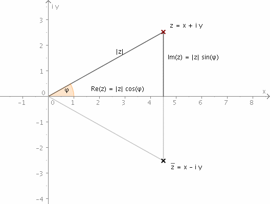

[//]: <> (2)

```{r setup, include = FALSE}
options(htmltools.dir.version = FALSE, stringsAsFactors = FALSE)
library(ggplot2)
library(cowplot)
library(dplyr)
library(reshape2)


medmov = function(x, n){

	res = rep(NA, length(x))
	
	for( i in (n+1):(length(x)-n) ){
	
		res[i] = mean( x[(i-n):(i+n)] )
	
	}
	
	return(res)

}

convert.fft <- function(cs, sample.rate=1) {
  cs <- cs / length(cs) # normalize

  distance.center <- function(c)signif( Mod(c),        4)
  angle           <- function(c)signif( 180*Arg(c)/pi, 3)
  
  df <- data.frame(cycle    = 0:(length(cs)-1),
                   freq     = 0:(length(cs)-1) * sample.rate / length(cs),
                   strength = sapply(cs, distance.center),
                   delay    = sapply(cs, angle))
  df
}

get.trajectory <- function(X.k,ts,acq.freq) {
  
  N   <- length(ts)
  i   <- complex(real = 0, imaginary = 1)
  x.n <- rep(0,N)           # create vector to keep the trajectory
  ks  <- 0:(length(X.k)-1)
  
  for(n in 0:(N-1)) {       # compute each time point x_n based on freqs X.k
    x.n[n+1] <- sum(X.k * exp(i*2*pi*ks*n/N)) / N
  }
  
  x.n * acq.freq 
}

plot.frequency.spectrum <- function(X.k, xlimits=c(0,length(X.k))) {
  plot.data  <- cbind(0:(length(X.k)-1), Mod(X.k))

  # TODO: why this scaling is necessary?
  plot.data[2:length(X.k),2] <- 2*plot.data[2:length(X.k),2] 
  
  plot(plot.data, t="h", lwd=2, main="", 
       xlab="Frequency (Hz)", ylab="Strength", 
       xlim=xlimits, ylim=c(0,max(Mod(plot.data[,2]))))
}

plot.harmonic <- function(Xk, i, ts, acq.freq, color="red") {
  Xk.h <- rep(0,length(Xk))
  Xk.h[i+1] <- Xk[i+1] # i-th harmonic
  harmonic.trajectory <- get.trajectory(Xk.h, ts, acq.freq=acq.freq)
  points(ts, harmonic.trajectory, type="l", col=color)
}
```

# Recapitulando

Hasta el momento hemos visto:

 - Características generales

 - Descomposición de series de tiempo
 
 - Autocorrelación
 
 - Identificación de *changepoints*
 
 - Una probadita de las frecuencias
 
Si bien no veremos estos conceptos directamente, nos ayudarán a entender mejor el contexto en el cual podemos usar Fourier

---
[//]: <> (3)

# Clase de hoy

Ahora nos metemos con la matemática. Si bien solo veremos 2 temas, pueden ser difíciles de entender.

- Series de Fourier
 
- Transformada de Fourier

- Análisis armónico

Disfruten la clase malditos!

.tiny[Pd. A medida que vean la presentación notarán una reducción en la calidad y cantidad del contenido hasta el punto que me llegó al chompiras y les puse videos para cerrar la presentación con "estilo". ]

---
[//]: <> (4)

class: middle, left
background-image: url("img/fourier.jpg")
background-size: cover

# El papi Fourier y sus series.

---
[//]: <> (5)

## Series de Fourier

El fundamento de las series de Fourier es sencillo y se le conoce como .bold[Ondas Complejas] (no confundir con números complejos...todavía).

--

En esencia, una Onda Compleja es la suma de dos o más ondas sinusoidales sobre una misma trayectoria (por ejemplo, sobre un mismo periodo de tiempo).

--

```{r, echo = F, fig.height = 4}
xs = seq(-2*pi, 2*pi, pi/100)
wave.1 = 0.50*sin(2*xs)
wave.2 = 0.25*sin(5*xs)
wave.df = data.frame(xs, wave.1, wave.2, wave.sum = wave.1 + wave.2)
wave.lon = melt(wave.df, id.vars = "xs", variable.name = "Waves", value.name = "Valor")
ej = ggplot(wave.lon, aes(x = xs, y = Valor)) +
    geom_line(colour = "red", size = 1) +
    geom_hline(yintercept = 0) +
    facet_wrap(~Waves, nrow = 3) +
    theme_cowplot(10) +
    panel_border()
plot(ej)
```
---
[//]: <> (6)

## Series de Fourier

Entonces, si queremos representar *cualquier* comportamiento ondulatorio, lo podemos hacer en base a sumas de $senos$ (o $cosenos$ también). A esta suma se le conoce como las .bold[Series de Fourier].

--

Ahora, hay unas pequeñas condiciones que cumplir.

- El sistema a analizar debe ser "lineal". Incorporar algo que no tenga que ver con $senos$ romperá la linealidad.

- Las series solo funcionan si se tiene un comportamiento periódico.

--
 
```{r, echo = F, fig.height = 4}
wave.df$wave.sum[wave.df$wave.sum > 0.5] = 0.5
ggplot(wave.df, aes(x = xs, y = wave.sum)) +
    geom_line(colour = "red", size = 1) +
    geom_hline(yintercept = 0) +
    theme_cowplot(10) +
    panel_border()
```

---
[//]: <> (7)

## Series de Fourier

### Algunos conceptos

- .bold[Periodo fundamental:] Es el periodo de tiempo entre la primera y última muestra.

--

- .bold[Ratio de muestreo:] Es el numero de muestras tomadas en un periodo de tiempo (también llamado *frecuencia de adquisición*).

--

- .bold[Intervalo de muestra:] Simplemente es el periodo fundamental entre el número de muestras.

--

- .bold[Frecuencia fundamental:] ( $f_0$ ) Es la frecuencia en que se repite el patrón principal. Todas las demas ondas que se encuentren en un patrón son multiplos de la frecuencia fundamental. A este grupo de múltiplos se les conoce como los .bold[armónicos].

---
[//]: <> (8)

## Series de Fourier

Volvamos al primer ejemplo e identifiquemos los conceptos.

```{r, echo = F, fig.height = 3.5}
plot(ej)
```

La ecuación de la última onda no será más que la suma de las dos anteriores. Se podría expresas de esta forma...

$$f(t)=0.5\times \sin(2wt)+0.25\times \sin(5wt)$$

---
[//]: <> (9)

## Series de Fourier

¿Cómo podemos interpretar esta fórmula?

$$f(t)=0.5\times \sin(2wt)+0.25\times \sin(5wt)$$

--

- $w$ es la frecuencia angular en radianes/segundo y se expresa como $w=2\pi f_0$. Si recuerdan, los enteros que multiplican a $f_0$ se les conoce como los armónicos, por lo que la primera onda es el 3er armónico y la segunda onda el 5to armónico.

--

- Los valores que multiplican a las ondas (0.5 y 0.25) son la amplitud que tiene cada onda. En otras palabras, la intensidad o "importancia" de cada armónico.

---
[//]: <> (10)

## Series de Fourier

### Cambios de fase

Hasta el momento hemos visto ondas que empiezan en un mismo punto (aunque se que ni cuenta se han dado). Bueno, podemos modificar esto si adicionamos un desfase.

Para ello tendremos que agregar un valor en radianes.

---
[//]: <> (11)

Por ejemplo, desfasemos en $\frac{\pi}{2}$ la primera onda.

$$f(t)=0.5\times \sin(2wt+\frac{\pi}{2})+0.25\times \sin(5wt)$$

--

```{r, echo = F, fig.height = 2.75}
xs = seq(-2*pi, 2*pi, pi/100)
wave.1 = 0.50*sin(2*xs+pi/2)
wave.2 = 0.25*sin(5*xs)
wave.df = data.frame(xs, wave.1, wave.2, wave.sum = wave.1 + wave.2)
wave.lon = melt(wave.df, id.vars = "xs", variable.name = "Waves", value.name = "Valor")
ej2 = ggplot(wave.lon, aes(x = xs, y = Valor)) +
    geom_line(colour = "blue", size = 1) +
    geom_hline(yintercept = 0) +
    facet_wrap(~Waves, nrow = 3) +
    theme_cowplot(10) +
    panel_border()
plot(ej2)
```
```{r, echo = F, fig.height = 2.75}
plot(ej)
```

---
[//]: <> (12)

## Series de Fourier

### *DC Componentes* (?)

El caso anterior (desfase) vimos cómo podemos mover las ondas en el eje x, pero también podemos hacerlo con eje y! Facilito noma!

...solo es sumarle o restarle a la ecuación general...

---
[//]: <> (13)

Si movemos la onda en 1 unidad en el eje y tendríamos.

$$f(t)=1+0.5\times \sin(2wt+\frac{\pi}{2})+0.25\times \sin(5wt)$$

--

```{r, echo = F, fig.height = 3}
xs = seq(-2*pi, 2*pi, pi/100)
wave.1 = 0.50*sin(2*xs+pi/2)
wave.2 = 0.25*sin(5*xs)
wave.df = data.frame(xs, wave.1, wave.2, wave.sum = 1+wave.1 + wave.2)
wave.lon = melt(wave.df, id.vars = "xs", variable.name = "Waves", value.name = "Valor")
ej3 = ggplot(wave.lon, aes(x = xs, y = Valor)) +
    geom_line(colour = "forestgreen", size = 1) +
    geom_hline(yintercept = 0) +
    facet_wrap(~Waves, nrow = 3) +
    theme_cowplot(10) +
    panel_border()
plot(ej3)
```
```{r, echo = F, fig.height = 3}
plot(ej2)
```

---
[//]: <> (14)

## Series de Fourier

Bueno, ya cubrimos las característias generales de las series de Fourier, es momento de ver la ecuación general, la expresión .bold[madre] de donde sale todo este .bold[desmadre].

--

$$f(t) = a_0 + \sum_k  a_k \times sin(kwt + \rho_k)$$

*¿Identifican todo lo que hemos visto?*

---
[//]: <> (15)

class: inverse, center, middle

# Bueno salgan a jugar un rato

Continuamos en 15 min

---
[//]: <> (16)

class: center, top
background-image: url("img/transformada.jpg")


# La Transformada de Fourier

---

layout: true

## La Transformada de Fourier (TF)

---
[//]: <> (17)

Como mencioné casi al principio, las series de Fourier se aplican a ondas periódicas. La Transformada de Fourier es la generalización del procedimiento para poder analizar ondas no periódicas.

--

La TF ve todas las trayectorias como un conjunto de movimientos circulares (esto es importante!).

--

Data una trayectoria, TF lo descompone en un conjunto de ciclos, con los cuales se puede volver a construir la trayectoria original (parecido a la series de Fourier).

---
[//]: <> (18)

Las trayecotrias son procesadas en base a filtros.

- Cada filtro da un ciclo y el resto de la trayecotria.

- Los filtros son independiente ya que miran un componente difernte de la trayectoria.

- Se pueden aplicar los filtros hasta que ya no quede trayectoria.

--

Existen dos algoritmos para tratar TF

- La Transformada de Fourier Discreta (el calladito que rinde como el conejo de Duracell).

- La Transformada de Fourier Rápida (el que acaba al toque pero te quita las ganas al menos).

---
[//]: <> (19)

### Números complejos


---
### Números complejos

[//]: <> (19.5)




Revisen este [link](http://www.math-kit.de/en/2003/content/CN-PB-XML-EN/rep//Manifest257/gauss.html) para lo básíco de números complejos.

---
[//]: <> (20)

"*ya ya profe, tu grafica muy bonita y todo, pero ¿para qué es necesario los número complejos? A parte de complicarnos la vida claro*"

--

Bueno, todo tiene su explicación en, tal vez, la fórmula más hermosa de las matemáticas (en serio, googleenlo si quieren).

--

$$e^{\pi i} + 1 = 0$$

--

¿Qué significa la fórmula de Euler en este caso?

Significa que una rotación de 180 grados ( $\pi$ radianes), el punto donde se ubicará en el eje x será de -1 (lado opuesto al inicio del círculo)

---
[//]: <> (21)

Un videoito para que me entiendas y lo veas más claro que tu futuro.

[](https://www.youtube.com/watch?v=v0YEaeIClKY)

---
[//]: <> (22)

Bueno, volviendo a la TF, trata de representar la trayectoria en base a ciclos circulares (un punto que se mueve en circulos). Estos ciclos tienen 3 características.

- Cuán rápido se mueve el punto en el círculo.

- Cuán grande es el círculo en el que gira el punto.

- Desde dónde empieza a girar el punto en el círculo.

---
[//]: <> (23)

Pongamos un ejemplo.

Asumamos que tenemos una serie de 4 puntos (1,2,3,4), todos separados por el mismo intervalo de tiempo (1 segundo por ejemplo) y queremos usar la TF para determinar una ecuación en el que, solo ingresando el tiempo, nos pueda dar los 4 puntos.

--

Pues tendríamos

```{r}
fft(1:4)/4
```

---
[//]: <> (24)

Podríamos verlo de esta forma tambien.

```{r, echo = F}
knitr::kable(convert.fft(fft(1:4)), format = "html")
```

--

¿y la velocidad?

--

Esos son los ciclos, que están expresados en la base al tiempo total (ciclos cada  4 segundos)

---
[//]: <> (25)

### Las ecuaciones

$$X_k = \sum_{n=0}^{N-1} x_n e^{-i.2\pi k n/N}$$

--

Lo que hace la TF es convertir una onda en el dominio del tiempo al dominio de la frecuencias. 

--

Existe un conjunto de ondas sinusoidales que sumadas dan la onda original. Cada una de estas ondas sinusoidales tienen su amplitud y frecuencia.

--

Si ploteamos la frecuencia vs la amplitud de cada onda, obtendremos el famoso .bold[Espectro de frecuencias]. Esta gráfica nos indicará cuál de las frecuencias es la más predominante en la onda original.

---
[//]: <> (26)

layout: false

## Transformada Inversa de Fourier (TI)

$$x_n = \frac{1}{N} \sum_{k=0}^{N-1} X_k e^{i.2\pi k n /N}$$

--

En esencia es lo contrario a la TF, donde del dominio de las frecuencias pasas al dominio del tiempo. El único detalle es que arroja un resultado interpolado.

--

Y ya está, mo hay mucha más magia que eso :v

---
[//]: <> (27)

Hagamos una prueba con la serie 1, 2, 3 y 4.

```{r, echo = F, warning = F}
X.k <- fft(c(1,2,3,4))                   # get amount of each frequency k

time     <- 4                            # measuring time interval (seconds)
acq.freq <- 100                          # data acquisition frequency (Hz)
ts  <- seq(0,time-1/acq.freq,1/acq.freq) # vector of sampling time-points (s) 

x.n <- get.trajectory(X.k,ts,acq.freq)   # create time wave

plot(ts,x.n,type="l",ylim=c(-2,4),lwd=2)
abline(v=0:time,h=-2:4,lty=3); abline(h=0)

plot.harmonic(X.k,1,ts,acq.freq,"red")
plot.harmonic(X.k,2,ts,acq.freq,"green")
plot.harmonic(X.k,3,ts,acq.freq,"blue")
```

---
[//]: <> (28)

Tener en cuenta que los resultados pueden tener un montoooooon de armónicos, pero no necesariamente son útiles, la mayoría son puro ruído.

---
[//]: <> (29)

### Espectro de Frecuencias

Bueno, les tendré que explicar así nomás porque no me dio tiempo de prearar la expliación, así que no me ignoren y anoten zanganazos.

```{r, echo = F}
acq.freq <- 100                    # data acquisition (sample) frequency (Hz)
time     <- 6                      # measuring time interval (seconds)
ts       <- seq(0,time-1/acq.freq,1/acq.freq) # vector of sampling time-points (s) 
f.0 <- 1/time

dc.component <- 1
component.freqs <- c(3,7,10)        # frequency of signal components (Hz)
component.delay <- c(0,0,0)         # delay of signal components (radians)
component.strength <- c(1.5,.5,.75) # strength of signal components

f   <- function(t,w) { 
  dc.component + 
  sum( component.strength * sin(component.freqs*w*t + component.delay)) 
}

w <- 2*pi*f.0
trajectory <- sapply(ts, function(t) f(t,w))

X.k <- fft(trajectory)                   # find all harmonics with fft()
plot.frequency.spectrum(X.k, xlimits=c(0,20))
```

---
[//]: <> (30)

## Y para cerrar... música... casi...

.tiny[otra vez...]

Bueno, otra vez les voy a poner a los españoles escandalosos, pero hacen un buena explicación de las ondas y cómo entra nuestro causa Fourier en todo esto.

[](https://www.youtube.com/watch?v=xcHbm0vXFFE&t=631s)

---
[//]: <> (31)

## Y algo más!

Este otro video si quieres profundizar más en el tema. Está en *English* pero tiene subtítulos en español.

[](https://www.youtube.com/watch?v=r6sGWTCMz2k&t=291s)

---
[//]: <> (32)

class: inverse, center, middle

# Gracias por aguantarme!

Si tienen dudas pueden escribirme a: dante.tcg@gmail.com

Las clases pueden encontrarlas en

<https://danteca.github.io/>

A las justas acabe


