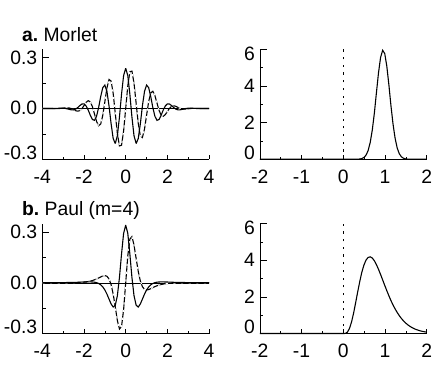
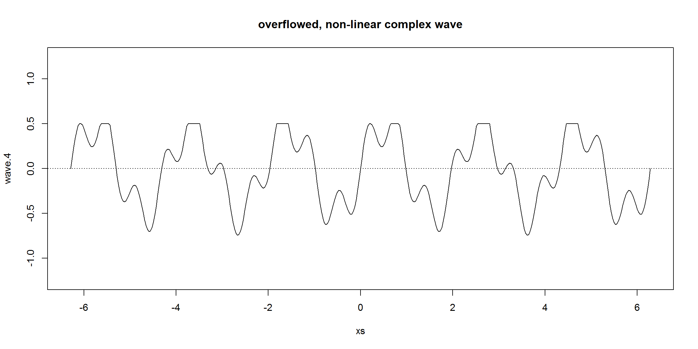
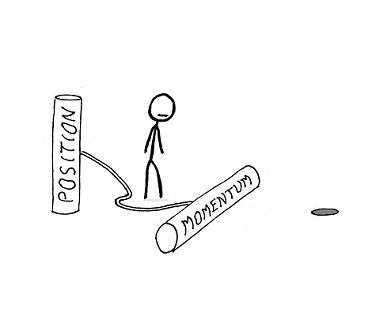

[//]: <> (2)

```{r setup, include = FALSE}
options(htmltools.dir.version = FALSE, stringsAsFactors = FALSE)
library(ggplot2)
library(cowplot)
library(dplyr)
library(reshape2)

autoreg = function(x, n){

	res = rep(NA, n)
	
	for(i in 1:n){
	
		res[i] = cor(x[1:(length(x)-i)], x[(1+i):length(x)])
	
	}
	
	return(res)

}

breakp = function(x){

	n = length(x)
	Tc = rep(NA, n)
	
	for(i in 2:(n-1)){
	
		ser1 = x[1:i]
		ser2 = x[(i+1):n]
		sp = (((i-1)*sd(ser1)^2 + (n-i-1)*sd(ser2)^2) / (n-2))^0.5
		Tc[i] = (mean(ser1) - mean(ser2)) / (sp*sqrt(1/i+1/(n-i)))
	
	}
	
	Tcmax = max(abs(Tc), na.rm = T)
	
	crit = numeric(1000)
	
	for(i in 1:1000){
		crit[i] = max(abs(rt(n, n-2)))
	}
	
	crit = mean(crit)
	
	if(Tcmax > crit){
		res = which(Tc == Tcmax)
	}else{
		res = NA
	}
	
	return(res)

}

dat = read.csv("data/Pilluana_proce.csv")
dat$Fecha = as.Date(dat$Fecha)

dat_long = melt(dat, 
	id.vars = c("Year", "Month", "Fecha"),
	variable.name = "Componente",
	value.name = "Precip")

```

# Recapitulando

Hasta el momento hemos visto:

- Características generales

- Descomposición de series de tiempo
 
- Autocorrelación
 
- Identificación de *changepoints*
 
- Series de Fourier

- Transformada de Fourier

--

Para que quede claro, lo mostraré con un ejemplo. De paso que concluyo la clase pasada que quedó a medias. .tiny[sorry :'v]

---
[//]: <> (3)

class: middle, left

# Recapitulaishon

### Con la steishon de Pilluana-shion

---
[//]: <> (4)

## Características generales de la serie de tiempo

La serie, media y desviación estándar

```{r, echo = F, warning = F}
cat(paste("Media:", mean(dat$Prec, na.rm = T)))
cat(paste("Desviación:"), sd(dat$Prec, na.rm = T))
```

```{r, echo = F, warning = F, fig.height = 4}
serie = ggplot(dat, aes(x = Fecha, y = Prec)) +
	geom_bar(stat = "identity", fill = "forestgreen") +
	ylab("Precipitación (mm/mes)") +
	coord_cartesian(expand = F) +
	theme_minimal_grid(12) +
	panel_border(colour = "black")
plot(serie)
```

---
[//]: <> (5)

## Descomposición de la serie de tiempo

```{r, echo = F, warning = F}
desc = ggplot(dat_long, aes(x = Fecha, y = Precip)) +
	geom_line(colour = "forestgreen") +
	facet_wrap(~Componente, nrow = 4) +
	theme_minimal_grid(12) +
	panel_border(colour = "black")
plot(desc)
```

---
[//]: <> (6)

## Autoregresión

```{r, echo = F, warning = F}
ar = data.frame(Lag = 1:20, AR = autoreg(dat$Prec, 20))
auto = ggplot(data = ar) +
	geom_segment(aes(x = Lag, xend = Lag, y = 0, yend = AR)) +
	geom_point(aes(x = Lag, y = AR), colour = "brown") +
	theme_minimal_grid(12) +
	panel_border(colour = "black")
plot(auto)
```

---
[//]: <> (7)

## *Break points*


```{r, echo = F, warning = F}
bp = breakp(dat$Prec)
print(bp)
```

--

Pos no hay... yeeeey

---
[//]: <> (8)

## Análisis espectral

```{r, echo = F, warning = F, fig.height = 5}
fou = fft(dat$Prec)
mds = Mod(fou)
spe = mds[2:round( length(mds)/2 )]
dat_spe = data.frame(Armonico = 1:round( length(mds)/2 - 1), Potencia = spe)

armon = dat_spe[dat_spe$Potencia > 4000, 1]
frec = length(dat$Prec) / armon
cat(paste("Armonicos:", armon[1], "y", armon[2]))
cat(paste("Frecuenca de armónico:", frec[1], "y", frec[2], "meses"))

spec = ggplot(data = dat_spe) +
	geom_segment(aes(x = Armonico, xend = Armonico, y = 0, yend = Potencia)) +
# 	geom_point(aes(x = Lag, y = AR), colour = "brown") +
	theme_minimal_grid(12) +
	panel_border(colour = "black")
plot(spec)
```

---
[//]: <> (9)

class:: inverse, center


# Wavelet



.bottom[### o en español *ondículas*]

---
[//]: <> (10)

### Primero que nada, es necesario responder estas preguntas existenciales

--

- ¿Qué es una serie estacional?

- ¿Qué es una serie estacionaria?

---
[//]: <> (11)

### Las limitantes de Fourier

Como lo mencioné la clase anterior, aplicar Fourier tiene algunas limitaciones.

La principal (y la que suele ocurrir) es que los datos usados no son estacionarios en el tiempo. Esto significa que los patrones estacionales que podamos encontrar (a escala anual por ejemplo) desaparezcan en un periodo determinado o pasen a otra frecuencia (por ejemplo bienal).

---
[//]: <> (12)

### Una gráfica de ejemplo



---
[//]: <> (13)

### ¿En qué se diferencia Fourier de Wavelet?

En realidad son muy parecidos. La transformada de Fourier convierte una serie tiempo en valores de frecuencia. 
--
La transformada (continua) de Wavelet hace la misma cosa, convierte el tiempo en frecuencia, peeeeero mantiene la dimensión del tiempo.

--

En otras palabras...

- Transformada de Fourier: Tiempo $\to$ Frecuencia

- Transformada de Wavelet: Tiempo $\to$ Frecuencia + Tiempo

---
[//]: <> (14)

## Ahora, no todo es color de rosa...

¿Recuerdan el Principio de Heisenberg?

--



---
[//]: <> (15)

Bueno, con Wavelet ocurre algo parecido.

Resulta que no puedes conocer la frecuencia con la que oscila una data sin perder especifidad en el tiempo, y viceversa.

--

Esto genera que puedas usar Wavelet para tener una mejor representación de las frecuencias, pero sacrificando su ubicación en el tiempo, o puedas ubicar bien el el tiempo el comportamiento oscilatorio, pero sacrificando la precisión de la frecuencia a la que oscila.

--

Si lo miras de cierta forma, la transformada de Fourier te da la frecuenia exacta pero sacrificando por completo el tiempo, es el caso extremo.

---
[//]: <> (16)

## ¿Cómo funciona?

Partamos de la transformada Fourier. En esencia tenemos una ecuación que convierte nuestro tiempos en frecuencia. Esta ecuación representa ondas sinusoidales de diferentes tamaños dependiendo de la frencuencia.

### Función madre

$$f(t) = A \times \sin (hwt + \rho)$$

### Funciones hijas (transformada)

$$X_k = \sum_{n=0}^{N-1} x_n e^{-i.2\pi k n/N}$$

---
[//]: <> (17)

En Wavelet también es lo mismo. Tenemos una función que convierte el tiempo en frecuencia y tiempo.

### Función madre de Morlet

$$\psi(t) = \pi ^ {-1/4} e ^ {i \omega t} e ^ {t^2/2}$$

### Ondas hijas

$$Wave(\tau, s) = \sum_{t} x_t \frac{1}{\sqrt s} \psi ^ \star \left(\frac{t - \tau}{s}\right)$$

El detalle es que la transformada de Wavelet tiene tiempo $t$, frecuencia $\omega$, pero crea un nuevo tiempo $\tau$ y una nueva frecuencia $s$.

---
[//]: <> (18)

### Oh fuck profe! Stoooop!

Ya ya.

En conclusión, Wavelet te permite ubicar en el tiempo y frecuencia un determinado comportamiento y analizar sus variaciones. Sin embargo, ya que no es específico en ninguno de los dos, solo te da una idea el comportamiento. La transformada de Fourier te da la frecuencia exacta, pero bajo algunos supuestos.

---
[//]: <> (19)

### Profe, grafiquitas nomás, la teoría es más densa que el quaker que tomé esta mañana

Ya ya. El Wavelet de la estacion Pilluana

```{r, include = F}
library(WaveletComp)
dat2 = data.frame("Prec" = dat$Prec, "date" = dat$Fecha)
pw = analyze.wavelet(
	dat2, "Prec",
	loess.span = 0,
	dt = 1/12, dj = 1/100,
	n.sim = 25)
```

```{r, echo = F, warning = F}
wt.image(pw, color.key = "quantile", n.levels = 100, legend.params = list(lab = "wavelet power levels", mar = 4.7), show.date = T, date.format = "%b %d")
```

---
[//]: <> (20)

### ¿Qué tenemos?

--

- Comportamiento periódico a un periodo de 0.5 (6 meses). Parece darse en todo momento, aunque se pierde ligeramente entre 1990 y 2000.

- Comportamiento periódico de menor intensidad anual (periodo 1, 12 meses),, pero solo entre 1980 - 1990 y 2005 - 2015.

- A escalas más altas parece no haber patrones.

- A frecuencias más altas parece existir algún patrón, pero puede ser ruido. Necesitamos usar una wavelet que represente mejor las escalas pequeñas o hacer un zoom en esas altas frecuencias.

- Alta frencuencia es igual a baja escala y viceversa por cierto :v.

---
[//]: <> (22)

class: inverse, center, middle

# Gracias por aguantarme!

Si tienen dudas pueden escribirme a: dante.tcg@gmail.com

Las clases pueden encontrarlas en

<https://danteca.github.io/>

Son libreeeees


